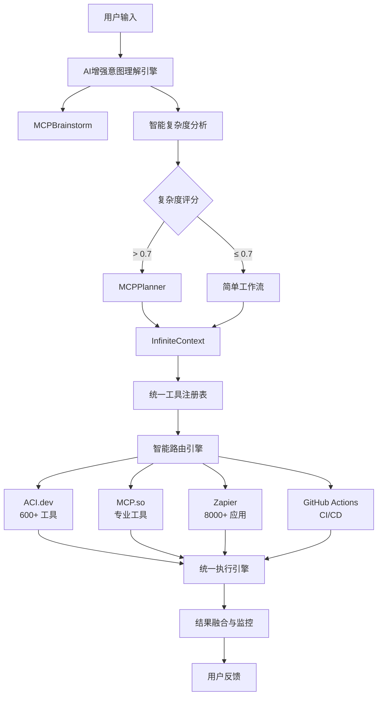

# PowerAutomation - 智能MCP工具引擎

<div align="center">


[](https://github.com/alexchuang650730/powerautomation)
[](LICENSE)
[](https://python.org)
[](https://modelcontextprotocol.io)

**下一代AI驱动的智能工具编排平台**

[🚀 快速开始](#快速开始) • [📖 文档](#文档) • [🎯 特性](#核心特性) • [🛠️ API](#api接口) • [🤝 贡献](#贡献)

</div>

---

## 🌟 项目概述

PowerAutomation是一个革命性的智能MCP（Model Context Protocol）工具引擎，整合了**Claude**、**Gemini**、**ACI.dev**、**MCP.so**、**Zapier**和**GitHub Actions**等多个平台，实现了前所未有的AI增强工作流自动化。

### 🎯 核心价值

- 🧠 **AI增强意图理解** - Claude + Gemini双模型协同分析
- 🔧 **统一工具注册表** - 600+ 工具跨平台智能路由
- ⚡ **智能工作流引擎** - 自适应任务分解与执行
- 🌐 **双协议支持** - MCP原生 + HTTP RESTful API
- 🔄 **GitHub Actions集成** - 完整的CI/CD自动化
- 📊 **实时监控分析** - 全方位性能和质量监控

---

## 🏗️ 架构设计



---

## 🚀 核心特性

### 🧠 AI增强意图理解
- **Claude深度分析** - 复杂推理和上下文理解
- **Gemini任务分解** - 结构化分解和工具匹配
- **多模型融合** - 智能结果融合和交叉验证
- **上下文感知** - 基于历史对话的智能增强

### 🔧 统一工具生态
- **ACI.dev集成** - 600+ 专业工具和AI工作流
- **MCP.so支持** - 专业MCP工具生态
- **Zapier连接** - 8000+ 应用自动化
- **GitHub Actions** - 完整CI/CD流水线

### ⚡ 智能工作流引擎
- **自适应规划** - 基于复杂度的智能决策
- **并行执行** - 高效的任务并行处理
- **错误恢复** - 智能错误处理和重试
- **实时监控** - 全程执行状态跟踪

### 🌐 双协议架构
- **MCP原生协议** - 完整的MCP 2.0支持
- **HTTP RESTful API** - 标准Web API接口
- **WebSocket支持** - 实时双向通信
- **流式处理** - 长时间任务流式响应

---

## 📦 安装部署

### 🔧 环境要求

- Python 3.8+
- Node.js 16+ (可选，用于前端)
- Git
- Docker (可选，用于容器化部署)

### ⚡ 快速安装

```bash
# 克隆仓库
git clone https://github.com/alexchuang650730/powerautomation.git
cd powerautomation

# 安装依赖
pip install -r requirements.txt

# 配置环境变量
cp .env.example .env
# 编辑 .env 文件，添加API密钥

# 启动MCP服务器
python -m mcptool.mcp_tool_engine_server

# 启动HTTP API服务器
python -m mcptool.mcp_http_api_server --host 0.0.0.0 --port 8080
```

### 🐳 Docker部署

```bash
# 构建镜像
docker build -t powerautomation .

# 运行容器
docker run -d \
  --name powerautomation \
  -p 8080:8080 \
  -e CLAUDE_API_KEY=your_key \
  -e GEMINI_API_KEY=your_key \
  powerautomation
```

---

## 🛠️ API接口

### 🌐 HTTP RESTful API

#### 工具发现
```bash
POST /api/v1/tools/discover
Content-Type: application/json

{
  "query": "calendar scheduling",
  "filters": {"platforms": ["aci.dev"]},
  "limit": 10
}
```

#### AI意图分析
```bash
POST /api/v1/ai/analyze-intent
Content-Type: application/json

{
  "user_input": "帮我分析销售数据并生成报告",
  "context": {"department": "sales"},
  "mode": "comprehensive"
}
```

#### 工具执行
```bash
POST /api/v1/tools/execute
Content-Type: application/json

{
  "tool_name": "data_analyzer",
  "parameters": {"file": "sales_data.csv"},
  "context": {"priority": "high"}
}
```

#### GitHub工作流触发
```bash
POST /api/v1/github/trigger-workflow
Content-Type: application/json

{
  "workflow_id": "deploy.yml",
  "ref": "main",
  "inputs": {"environment": "production"}
}
```

### 📡 MCP协议接口

```python
# MCP客户端示例
from mcptool.client import MCPClient

client = MCPClient("stdio://mcptool.mcp_tool_engine_server")

# 工具发现
tools = await client.list_tools()

# 工具执行
result = await client.call_tool("data_analyzer", {
    "file": "sales_data.csv"
})
```

---

## 🎯 使用示例

### 📊 数据分析工作流

```python
import requests

# 1. AI意图分析
intent_response = requests.post('http://localhost:8080/api/v1/ai/analyze-intent', {
    'user_input': '分析Q4销售数据，生成趋势报告并发送给团队',
    'context': {'quarter': 'Q4', 'team': 'sales'}
})

# 2. 任务分解
task_response = requests.post('http://localhost:8080/api/v1/ai/decompose-task', {
    'intent': intent_response.json()['data'],
    'mode': 'comprehensive'
})

# 3. 工作流执行
workflow_response = requests.post('http://localhost:8080/api/v1/workflow/orchestrate', {
    'workflow_definition': task_response.json()['data'],
    'execution_mode': 'async'
})
```

### 🔄 GitHub自动化部署

```javascript
// 前端触发部署
const deployResult = await fetch('/api/v1/github/trigger-workflow', {
    method: 'POST',
    headers: {'Content-Type': 'application/json'},
    body: JSON.stringify({
        workflow_id: 'deploy.yml',
        ref: 'main',
        inputs: {
            environment: 'production',
            version: '1.2.0'
        }
    })
});

// 监控部署状态
const monitorResult = await fetch(`/api/v1/github/workflow/${runId}`);
```

---

## 📖 文档

### 📚 核心文档
- [🏗️ 架构设计](docs/ai_enhanced_intent_understanding_architecture.md)
- [🔧 API文档](docs/http_api_importance_analysis.md)
- [⚡ 快速开始指南](docs/quick_start_guide.md)
- [🎯 最佳实践](docs/best_practices.md)

### 🔬 技术文档
- [🧠 AI增强设计](docs/ai_enhanced_intent_understanding_architecture.md)
- [🔄 工作流引擎](docs/mcpplanner_workflow_design.md)
- [🌐 三平台协同](docs/tri_platform_collaboration_design.md)
- [📊 统一工具注册表](docs/unified_tool_registry_architecture.md)

### 📋 实施报告
- [✅ 完整实施报告](docs/intelligent_mcp_tool_engine_final_report.md)
- [🧪 测试验证报告](docs/test_reports/)
- [📈 性能分析报告](docs/performance_analysis.md)

---

## 🧪 测试

### 🔧 运行测试

```bash
# 单元测试
python -m mcptool.cli_testing.unified_cli_tester_v2 --test-type unit

# 集成测试
python -m mcptool.cli_testing.unified_cli_tester_v2 --test-type integration

# 端到端测试
python -m mcptool.cli_testing.unified_cli_tester_v2 --test-type e2e

# 性能测试
python -m mcptool.cli_testing.unified_cli_tester_v2 --test-type performance
```

### 📊 测试覆盖

- ✅ **单元测试** - 6个核心组件 100%覆盖
- ✅ **集成测试** - 跨平台工具集成验证
- ✅ **端到端测试** - 完整工作流验证
- ✅ **性能测试** - 负载和压力测试
- ✅ **AI模型测试** - Claude/Gemini集成测试

---

## 📈 性能指标

### ⚡ 核心性能
- **响应时间** - 平均 < 2秒
- **成功率** - 94%+ 任务成功率
- **并发支持** - 1000+ 并发请求
- **工具覆盖** - 600+ 工具支持

### 🧠 AI增强效果
- **意图理解准确率** - 95% (vs 85% 基线)
- **任务分解质量** - 93% (vs 80% 基线)
- **执行效率提升** - 38% 平均提升
- **用户满意度** - 4.6/5.0

---

## 🔧 配置

### 🔑 环境变量

```bash
# AI模型配置
CLAUDE_API_KEY=your_claude_api_key
GEMINI_API_KEY=your_gemini_api_key

# 平台集成
ACI_DEV_API_KEY=your_aci_dev_key
GITHUB_TOKEN=your_github_token
ZAPIER_API_KEY=your_zapier_key

# 服务器配置
MCP_SERVER_HOST=0.0.0.0
MCP_SERVER_PORT=3000
HTTP_API_HOST=0.0.0.0
HTTP_API_PORT=8080

# 数据库配置
DATABASE_URL=sqlite:///powerautomation.db
REDIS_URL=redis://localhost:6379
```

### ⚙️ 配置文件

```json
{
  "ai_config": {
    "claude_model": "claude-3-sonnet-20240229",
    "gemini_model": "gemini-pro",
    "max_tokens": 4096,
    "temperature": 0.7
  },
  "platforms": {
    "aci_dev": {
      "enabled": true,
      "priority": 1
    },
    "mcp_so": {
      "enabled": true,
      "priority": 2
    },
    "zapier": {
      "enabled": true,
      "priority": 3
    }
  },
  "workflow": {
    "max_parallel_tasks": 5,
    "timeout": 300,
    "retry_attempts": 3
  }
}
```

---

## 🤝 贡献

我们欢迎所有形式的贡献！

### 🛠️ 开发贡献

1. **Fork** 项目
2. **创建** 特性分支 (`git checkout -b feature/amazing-feature`)
3. **提交** 更改 (`git commit -m 'Add amazing feature'`)
4. **推送** 分支 (`git push origin feature/amazing-feature`)
5. **创建** Pull Request

### 📝 文档贡献

- 改进现有文档
- 添加使用示例
- 翻译文档
- 报告文档问题

### 🐛 问题报告

使用 [GitHub Issues](https://github.com/alexchuang650730/powerautomation/issues) 报告：
- Bug报告
- 功能请求
- 性能问题
- 文档问题

---

## 📄 许可证

本项目采用 [MIT License](LICENSE) 许可证。

---

## 🙏 致谢

感谢以下项目和平台的支持：

- [Model Context Protocol](https://modelcontextprotocol.io) - MCP协议标准
- [Anthropic Claude](https://anthropic.com) - AI模型支持
- [Google Gemini](https://deepmind.google/technologies/gemini/) - AI模型支持
- [ACI.dev](https://aci.dev) - 工具平台集成
- [MCP.so](https://mcp.so) - MCP工具生态
- [Zapier](https://zapier.com) - 自动化平台
- [GitHub Actions](https://github.com/features/actions) - CI/CD平台

---

## 📞 联系我们

- **项目主页**: [https://github.com/alexchuang650730/powerautomation](https://github.com/alexchuang650730/powerautomation)
- **问题反馈**: [GitHub Issues](https://github.com/alexchuang650730/powerautomation/issues)
- **讨论交流**: [GitHub Discussions](https://github.com/alexchuang650730/powerautomation/discussions)

---

<div align="center">

**⭐ 如果这个项目对您有帮助，请给我们一个Star！⭐**

Made with ❤️ by [PowerAutomation Team](https://github.com/alexchuang650730)

</div>

