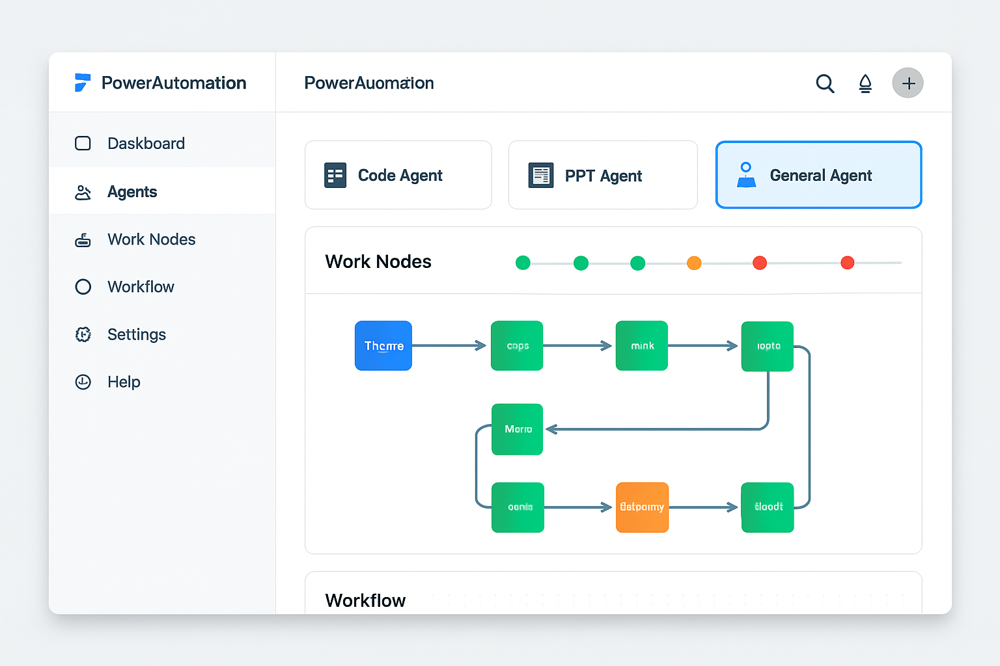
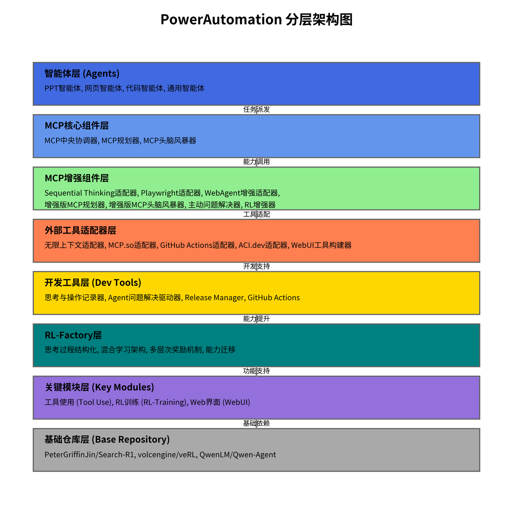

# PowerAutomation 项目说明

## 项目概述

PowerAutomation是一个企业多智能体协同平台，集成了代码、PPT、网页和通用四种智能体，通过六大特性定义和MCP组件实现高效的任务处理和智能体协作。本项目实现了多智能体路由、六特性存储、自动化测试、RL Factory能力对齐等核心功能，并增强了版本回滚能力、工作节点可视化功能和工作流整合能力。

## 用户交互设计图

下图展示了PowerAutomation系统的用户界面设计：



*图1: PowerAutomation用户交互设计图，展示了两栏式布局、智能体卡片、工作节点时间线和工作流可视化等核心UI组件*

## 目录结构

```
powerautomation/
├── agents/                     # 智能体目录
│   ├── code_agent/             # 代码智能体
│   ├── general_agent/          # 通用智能体
│   │   └── general_agent_features.py  # 通用智能体六大特性定义
│   ├── ppt_agent/              # PPT智能体
│   │   ├── __init__.py         # PPT智能体初始化文件
│   │   ├── ppt_agent_features.py  # PPT智能体六大特性定义
│   │   ├── ppt_task_manager.py    # PPT任务管理器
│   │   ├── ppt_to_image.py        # PPT转图片工具
│   │   └── templates/             # PPT模板目录
│   ├── web_agent/              # 网页智能体
│   └── workflow_driver/        # 工作流驱动智能体
├── backend/                    # 后端目录
│   ├── routes/                 # API路由
│   ├── services/               # 服务层
│   └── main.py                 # 后端入口文件
├── config/                     # 配置文件目录
│   ├── agent_problem_solver.json  # 问题解决器配置
│   ├── release_manager.json       # 发布管理器配置
│   ├── rollback_history.json      # 回滚历史记录
│   ├── savepoints.json            # 保存点配置
│   └── work_nodes.json            # 工作节点配置
├── development_tools/          # 开发工具
│   ├── agent_problem_solver.py    # 问题解决驱动器
│   ├── proactive_problem_solver.py # 主动问题解决器
│   └── release_manager.py         # 发布管理器
├── docs/                       # 文档目录
│   └── images/                 # 文档图片
├── frontend/                   # 前端目录
│   ├── src/                    # 源代码
│   │   ├── components/         # 组件
│   │   │   ├── AgentCards.tsx       # 智能体卡片组件
│   │   │   ├── InputArea.tsx        # 输入区组件
│   │   │   ├── IntegratedWorkflowView.tsx # 工作流整合视图组件
│   │   │   ├── N8nWorkflowVisualizer.tsx # 工作流可视化组件
│   │   │   ├── Sidebar.tsx          # 侧边导航栏组件
│   │   │   └── workflow-nodes/      # 工作流节点组件
│   │   ├── styles/             # 样式文件
│   │   ├── App.tsx             # 主应用组件
│   │   └── main.tsx            # 应用入口
│   └── package.json            # 前端依赖配置
├── mcptool/                    # MCP工具
│   ├── adapters/               # 外部工具适配器
│   ├── core/                   # 核心组件
│   ├── enhancers/              # 增强组件
│   └── mcp/                    # MCP实现
├── releases/                   # 发布目录
│   └── test_release/           # 测试发布
├── rl_factory/                 # RL Factory
│   ├── adapters/               # 适配器
│   ├── core/                   # 核心组件
│   │   ├── learning/           # 学习模块
│   │   └── thought/            # 思考模块
│   └── tests/                  # RL Factory测试
├── test/                       # 测试目录
│   ├── end_to_end/             # 端到端测试
│   ├── integration/            # 集成测试
│   └── visual_test/            # 视觉自动化测试
└── workflow_driver/            # 工作流驱动器
    └── workflow_driver.py      # 工作流驱动实现
```

## 系统架构图

下图展示了PowerAutomation系统的分层架构设计：



*图2: PowerAutomation系统架构图，展示了系统的分层结构、组件关系和数据流转路径*

## 核心功能

### 1. 多智能体路由

代码智能体能够分析用户输入，决定最合适的处理智能体，实现智能路由：
- 代码相关需求由代码智能体处理
- 通用需求路由到通用智能体
- PPT相关需求自动路由到PPT智能体
- 网页需求路由到网页智能体

系统实现了智能意图识别，当通用智能体或其他智能体遇到PPT相关意图时，会自动路由到PPT智能体进行处理，确保专业任务由专业智能体完成。

### 2. 通用智能体六大特性

系统实现了通用智能体六大特性的定义、存储和流转：

#### 2.1 平台特性
- 多平台集成能力：支持与GitHub、CI/CD平台、本地开发环境的无缝集成
- 跨环境兼容性：在Windows、macOS和Linux环境下保持一致的功能表现
- API接口标准化：提供统一的REST API接口，支持第三方系统调用
- 自动化测试：自动执行测试用例，收集测试结果，分析测试覆盖率，生成测试报告
- 基于原结构扩展：所有功能扩展严格基于原有文件结构，确保系统稳定性和一致性
- 集成工作流管理：将工作节点和工作流程整合在统一界面，提供一致的用户体验

#### 2.2 UI布局特性
- 两栏式布局：左侧为Sidebar导航栏，右侧为主内容区
- 响应式设计：自适应不同屏幕尺寸，确保在桌面和移动设备上的良好体验
- 主题定制：支持明暗主题切换和企业级视觉风格定制
- 智能体卡片布局：横向四等分布局，展示四种智能体模式（代码、PPT、网页和通用）
- 工作节点可视化：展示工作节点和测试部署状态
- n8n风格工作流可视化：直观展示工作流程和数据流转
- 集成输入区域：在智能体卡片上方添加输入框，支持文本输入、文件上传和消息发送
- 统一工作节点与工作流视图：将工作节点时间线和工作流程图整合在同一界面

#### 2.3 提示词特性
- 上下文感知提示：根据测试阶段和问题类型生成针对性提示
- 多语言支持：支持中英文等多语言提示和报告生成
- 技术术语识别：准确识别并解释测试和开发领域的专业术语
- 智能体生成支持：通用智能体支持智能体生成部分，能够根据需求自动创建和配置专用智能体
- 自动UI布局：根据内容和上下文自动调整和优化UI布局，提供最佳用户体验
- 智能体模式自适应提示：根据选择的智能体模式自动调整输入框提示文本和功能引导

#### 2.4 思维特性
- 测试策略规划：自动分析代码结构，制定最优测试策略
- 问题根因分析：通过调用Manus能力，深入分析测试失败原因
- 修复方案生成：基于历史数据和最佳实践，提供针对性修复建议
- 优先级排序：智能评估问题严重性，合理安排修复顺序
- 版本回滚能力：智能确认版本回滚需求，执行回滚操作并验证回滚结果
- 自动化制造智能体：根据需求自动生成、训练和部署专用智能体
- 工作流优化：分析工作流执行效率，识别瓶颈并提供优化建议

#### 2.5 内容特性
- 测试报告生成：自动生成结构化、可视化的测试报告，支持自动GitHub提交
- GitHub集成：将测试结果自动提交到GitHub，支持Issue创建和更新
- 代码文档生成：为测试代码和修复方案生成规范文档
- 代码注释生成：为测试用例和修复代码生成清晰的注释
- 文档自动更新：自动更新README和相关文档，反映最新测试状态
- 知识库集成：将测试经验和解决方案整合到知识库中
- 消息历史管理：记录和管理用户与智能体的交互历史
- 文件附件处理：管理用户上传的文件，支持多种文件类型的处理和分析

#### 2.6 记忆特性
- 检查点管理：创建和管理代码检查点，支持快速回滚和比较，并在Agent UI中反映
- 测试历史追踪：记录并分析历史测试结果，识别趋势和模式
- 历史数据分析：分析历史测试数据，识别趋势和模式
- 知识库构建：积累常见问题和解决方案，形成项目专属知识库
- 知识图谱集成：构建测试知识图谱，支持复杂关系查询和推理
- ReleaseManager能力：监控GitHub release事件，自动下载代码到指定路径，支持SSH密钥认证
- 持续学习：通过每次测试和修复过程不断优化测试策略和问题解决方法
- 上下文持久化：保存和恢复测试上下文，支持长期任务和多会话协作
- SuperMemory集成：通过SuperMemory API确保六大特性定义永久存储且不可抹除，每次指令执行前自动校验
- 工作流状态持久化：保存工作流执行状态和历史记录，支持断点恢复和历史回溯

### 3. PPT智能体六大特性

系统实现了PPT智能体六大特性的定义、存储和流转，与通用智能体六大特性一样受SuperMemory API保护：

#### 3.1 平台特性
- PowerAutomation集成：与PowerAutomation平台无缝集成，实现统一任务管理和路由
- 文件格式处理：支持多种输入文件格式（文本、Markdown、数据文件）和输出格式（PPTX, PDF, 图片）
- 外部API集成：支持调用外部API获取数据、图片或增强内容生成能力

#### 3.2 UI布局特性
- 专用PPT界面：提供专门用于PPT创建和编辑的用户界面，包括模板选择器、大纲编辑器等
- 进度可视化：直观显示PPT生成任务的进度和状态，包括任务时间线、步骤指示器等
- 响应式设计：UI布局自适应不同屏幕尺寸，支持桌面和平板设备

#### 3.3 提示词与模板特性
- 自然语言理解：理解用户通过自然语言提出的PPT创建需求（主题、大纲、风格等）
- 模板管理：提供、选择和管理PPT模板库，支持自定义模板和模板推荐
- 上下文提示：根据用户输入和选择的模板，提供智能化的内容填充和设计建议提示

#### 3.4 思维与内容生成特性
- AI内容生成：利用AI能力（如Skywork）生成PPT的核心内容、摘要和讲者备注
- 布局优化：根据内容自动选择和优化幻灯片布局，确保视觉层次清晰
- 视觉元素建议：根据幻灯片内容智能建议合适的图片、图表或图标
- 逻辑流程与连贯性：确保PPT内容逻辑清晰、流程连贯、前后呼应

#### 3.5 内容特性
- 多模态输入处理：处理文本、数据、图片等多种输入素材，并将其整合到PPT中
- PPT生成引擎：基于python-pptx或其他库生成高质量的PPTX文件
- 多格式导出：支持将生成的PPT导出为PDF、图片序列等多种格式
- 视觉证据整合：整合生成的视觉证据（如PPT截图）用于验证和报告

#### 3.6 记忆特性
- 任务历史管理：记录所有PPT生成任务的详细历史，包括输入、配置和结果
- 模板记忆：存储和管理用户上传的自定义模板和常用模板
- 生成检查点：在PPT生成过程中保存检查点，支持从中断处恢复或回滚，并在UI中反映
- 用户偏好记忆：记忆用户的常用风格、模板和导出设置
- SuperMemory集成：通过SuperMemory API确保PPT Agent六大特性定义永久存储且不可抹除，每次指令执行前自动校验

### 4. 核心治理原则

所有功能扩展和UI更新均遵循五大核心治理原则：

1. **结构保护原则**：所有功能扩展严格基于原本的文件结构进行，不会更改现有结构
2. **兼容性原则**：新增功能必须与现有功能保持向后兼容，确保系统稳定性
3. **空间利用原则**：UI扩展只在空白区域进行，不影响原有控件和布局
4. **模块化原则**：新功能作为独立模块添加，不修改现有代码逻辑
5. **一致性原则**：保持与现有代码风格和架构的一致性

### 5. 版本回滚能力

系统增强了AgentProblemSolver的版本回滚能力：
- 回滚历史记录和统计功能
- 回滚前后对比验证
- 工作节点记录和管理
- 检查点管理

### 6. 工作节点与工作流整合

系统实现了工作节点与工作流的统一视图：
- 工作节点时间线：直观展示任务执行状态和进度
- n8n风格工作流可视化：展示节点连接和数据流转
- 垂直布局整合：工作节点在上，工作流在下，提供连贯的任务执行视图
- 状态同步：工作节点状态变化自动反映到工作流视图

### 7. 输入区与智能体交互

系统实现了智能体上方的输入区域：
- 多行文本输入：支持复杂指令和需求描述
- 文件上传功能：支持拖放和按钮上传
- 智能体模式自适应：根据选择的智能体自动调整输入框提示文本
- 消息历史显示：记录用户与智能体的交互历史

### 8. 自动化测试

系统实现了完整的自动化测试框架：
- 单元测试：测试各组件的独立功能
- 集成测试：测试组件间的交互
- 端到端测试：测试完整工作流程

### 9. RL Factory能力对齐

RL Factory实现了与MCPPlanner和MCPBrainstorm的能力对齐：
- 以MCPPlanner和MCPBrainstorm的输入作为学习者
- 持续强化学习对齐ThoughtActionRecorder的输入
- 通过迭代训练达到与ThoughtActionRecorder相同的输入处理水平

### 10. SuperMemory集成与治理机制

系统实现了SuperMemory集成与治理机制：
- 特性定义永久存储：通用智能体和PPT智能体的六大特性定义永久存储在SuperMemory中
- 不可抹除机制：特性定义受保护，不可被修改或删除
- 自动校验：每次指令执行前通过SuperMemory API进行自动校验
- 保存点UI反映：保存点状态和回溯功能在Agent UI中直观反映
- 治理规则执行：确保所有操作符合五大核心治理原则

## 安装与使用

### 安装

1. 克隆代码仓库
```bash
git clone https://github.com/alexchuang650730/powerautomation.git
cd powerautomation
```

2. 安装后端依赖
```bash
cd backend
python -m venv venv
source venv/bin/activate  # 在Windows上使用 venv\Scripts\activate
pip install -r ../requirements.txt
```

3. 安装前端依赖
```bash
cd ../frontend
npm install --legacy-peer-deps  # 使用legacy-peer-deps解决依赖冲突
# 或者降级date-fns到兼容版本
# npm install date-fns@3.0.0
```

### 运行

1. 启动后端
```bash
cd backend
python main.py  # 注意：入口文件是main.py，不是app.py
```

2. 启动前端
```bash
cd frontend
npm run dev
```

3. 访问应用
打开浏览器，访问 http://localhost:5173

### 运行测试

1. 运行单元测试
```bash
python -m pytest test/unit/
```

2. 运行集成测试
```bash
python -m pytest test/integration/
```

3. 运行端到端测试
```bash
python -m pytest test/end_to_end/
```

## 常见问题

### 后端依赖问题

如果遇到缺少依赖的错误（如 `ModuleNotFoundError: No module named 'flask_cors'`），请确保已安装所有必要的依赖：

```bash
pip install -r requirements.txt
```

如果仍有缺失的依赖，可以单独安装：

```bash
pip install flask-cors
```

### 前端依赖冲突

如果在安装前端依赖时遇到冲突（如date-fns与react-day-picker的版本冲突），可以：

1. 使用`--legacy-peer-deps`参数：
```bash
npm install --legacy-peer-deps
```

2. 或降级date-fns到兼容版本：
```bash
npm install date-fns@3.0.0
```

### 前端UI不显示

如果前端UI无法正常显示，请检查：

1. 确保后端服务正在运行
2. 尝试使用IP地址代替localhost：http://127.0.0.1:5173
3. 如果需要从其他设备访问，使用`--host`参数启动前端：
```bash
npm run dev -- --host
```

## 文档

详细文档请参阅docs目录。

## 贡献指南

1. Fork本仓库
2. 创建功能分支 (`git checkout -b feature/amazing-feature`)
3. 提交更改 (`git commit -m 'Add some amazing feature'`)
4. 推送到分支 (`git push origin feature/amazing-feature`)
5. 创建Pull Request

## 许可证

本项目采用MIT许可证 - 详情请参阅[LICENSE](LICENSE)文件。
