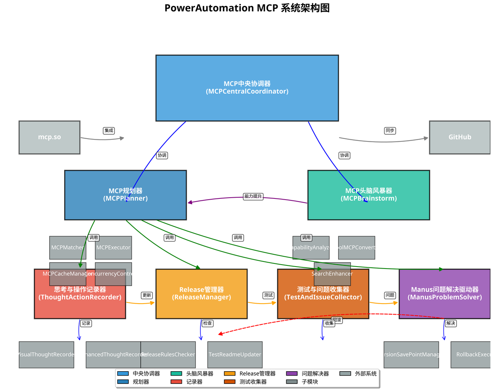

# PowerAutomation 集成方案

本仓库包含PowerAutomation的增强模块，集成了Sequential Thinking MCP和Playwright MCP（含WebAgentB增强），显著提升了系统的任务规划、创意生成和问题解决能力。

## 1. 项目概述

PowerAutomation是一个多智能体自动化平台，支持PPT智能体、代码智能体、网页智能体和通用智能体。本集成方案通过引入Sequential Thinking MCP和Playwright MCP（含WebAgentB增强），为系统增加了以下核心能力：

- **任务拆解与规划**：通过Sequential Thinking实现更精细的任务拆解和动态调整
- **网页自动化与信息获取**：通过Playwright实现自动化网页操作和信息收集
- **语义理解与交互**：通过WebAgentB实现高级网页理解与交互能力
- **主动问题解决**：实现主动发现问题并推送解决方案到GitHub的功能

## 2. 智能体类型

PowerAutomation平台支持多种专业智能体，每种智能体都有其特定的功能和应用场景：

### 2.1 PPT智能体

PPT智能体专注于创建高质量的演示文稿，具备以下能力：

- **文本转PPT**：将文本内容自动转换为结构化的PPT演示文稿
- **思维导图转PPT**：将思维导图数据转换为逻辑清晰的PPT
- **模板应用**：支持多种专业模板，一键应用
- **自动排版和设计**：智能调整布局、字体和颜色方案
- **内容优化**：通过MCP头脑风暴器优化演示内容

### 2.2 网页智能体

网页智能体提供强大的网页交互和数据处理能力：

- **网页内容抓取**：高效抓取网页内容，支持复杂页面结构
- **数据提取与结构化**：将非结构化网页数据转换为结构化格式
- **网页自动化操作**：模拟用户操作，执行复杂的网页任务
- **内容分析与摘要**：智能分析网页内容，生成摘要和关键点
- **多页面导航与数据聚合**：跨页面收集和整合信息

### 2.3 代码智能体

代码智能体专注于代码生成、分析和优化：

- **代码生成**：根据需求描述生成符合规范的代码
- **代码分析**：识别代码问题和优化机会
- **重构建议**：提供代码重构和改进建议
- **文档生成**：自动生成代码文档和注释
- **测试用例生成**：为代码自动创建测试用例

### 2.4 通用智能体

通用智能体作为平台的核心协调者，具备以下能力：

- **任务分发**：将复杂任务分解并分发给专业智能体
- **结果整合**：整合各智能体的处理结果
- **上下文管理**：维护任务上下文，确保连贯性
- **多轮对话**：支持与用户进行多轮交互
- **资源调度**：优化系统资源分配

## 3. MCP增强模块

本集成方案引入了六大MCP（多智能体通信协议）增强模块，显著提升了系统的能力：

### 3.1 Sequential Thinking适配器

Sequential Thinking适配器提供任务拆解和反思能力：

- **任务分解**：将复杂任务分解为可管理的子任务
- **依赖关系管理**：识别和管理子任务间的依赖关系
- **反思与优化**：对执行计划进行反思和优化
- **todo.md生成**：创建结构化的任务清单
- **状态追踪**：追踪任务完成状态

```python
from agents.ppt_agent.core.mcp.sequential_thinking_adapter import SequentialThinkingAdapter

# 初始化Sequential Thinking适配器
adapter = SequentialThinkingAdapter()

# 分解任务
task_result = adapter.decompose_task("设计一个智能家居系统")
```

### 3.2 Playwright适配器

Playwright适配器提供浏览器自动化能力：

- **信息搜索**：自动搜索和获取网络信息
- **页面内容提取**：提取网页内容和结构
- **创意验证**：验证创意的可行性
- **交互式探索**：交互式探索网页内容
- **截图功能**：捕获网页或元素截图

```python
from agents.ppt_agent.core.mcp.playwright_adapter import PlaywrightAdapter

# 初始化Playwright适配器
adapter = PlaywrightAdapter()

# 访问网页
page_content = adapter.visit_and_extract("https://example.com")
```

### 3.3 WebAgentB增强适配器

WebAgentB增强适配器提供高级网页理解与交互能力：

- **增强搜索**：支持多层次信息收集
- **语义化提取**：语义化理解和提取页面内容
- **交互式任务**：执行复杂的交互式网页任务
- **深度分析**：对网页内容进行深度语义分析
- **关联页面探索**：智能探索相关页面内容

```python
from agents.ppt_agent.core.mcp.webagent_adapter import WebAgentBAdapter

# 初始化WebAgentB适配器
adapter = WebAgentBAdapter()

# 语义搜索
search_results = adapter.enhanced_search("人工智能最新进展")
```

### 3.4 增强版MCP规划器

增强版MCP规划器集成Sequential Thinking能力：

- **结构化规划**：生成结构化的任务执行计划
- **阶段性反思**：在规划过程中进行反思和调整
- **依赖管理**：管理任务间的复杂依赖关系
- **计划执行**：执行和监控规划好的任务
- **todo状态更新**：自动更新任务状态

```python
from agents.ppt_agent.core.mcp.enhanced_mcp_planner import EnhancedMCPPlanner

# 初始化增强版MCP规划器
planner = EnhancedMCPPlanner()

# 规划任务
plan = planner.plan("开发一个在线教育平台")
```

### 3.5 增强版MCP头脑风暴器

增强版MCP头脑风暴器集成Playwright自动化能力：

- **信息增强创意**：基于网络信息生成创意
- **创意验证**：验证创意的可行性
- **交互式探索**：交互式探索和优化创意
- **创意可视化**：可视化展示创意内容
- **结构化输出**：生成结构化的创意方案

```python
from agents.ppt_agent.core.mcp.enhanced_mcp_brainstorm import EnhancedMCPBrainstorm

# 初始化增强版MCP头脑风暴器
brainstorm = EnhancedMCPBrainstorm()

# 生成创意
ideas = brainstorm.generate("智能家居创新应用")
```

### 3.6 主动问题解决器

主动问题解决器集成Sequential Thinking和WebAgentB能力：

- **问题主动发现**：主动发现系统中的问题
- **解决方案生成**：自动生成问题解决方案
- **GitHub集成**：将解决方案推送到GitHub
- **Pull Request创建**：自动创建Pull Request
- **事件触发处理**：基于事件触发问题解决流程

```python
from agents.ppt_agent.core.mcp.proactive_problem_solver import ProactiveProblemSolver

# 初始化主动问题解决器
solver = ProactiveProblemSolver("/path/to/repo")

# 手动触发检查
result = solver.solve_on_event("manual_check")
```

## 4. 开发工具模块

PowerAutomation平台包含多种开发工具模块，支持智能体的开发和运行：

### 4.1 思考与操作记录器

记录智能体的思考过程和操作，用于调试和优化：

- **会话管理**：创建和管理智能体会话
- **思考记录**：记录智能体的思考过程
- **操作记录**：记录智能体执行的操作
- **结果追踪**：追踪操作的结果
- **日志导出**：导出详细的会话日志

### 4.2 智能体问题解决器

帮助解决智能体运行中遇到的问题：

- **问题诊断**：诊断智能体运行问题
- **解决方案推荐**：推荐问题解决方案
- **自动修复**：自动修复常见问题
- **性能优化**：优化智能体性能
- **错误报告**：生成详细的错误报告

### 4.3 Release管理器

管理系统的发布和版本：

- **版本控制**：管理系统版本
- **变更记录**：记录版本变更
- **发布管理**：管理发布流程
- **回滚支持**：支持版本回滚
- **发布通知**：自动发送发布通知

### 4.4 测试与问题收集器

收集和管理测试结果和问题：

- **测试执行**：执行自动化测试
- **结果收集**：收集测试结果
- **问题分类**：分类和优先级排序
- **报告生成**：生成测试报告
- **趋势分析**：分析问题趋势

## 5. 架构设计

### 5.1 核心模块

```
powerautomation/
├── agents/                     # 智能体模块
│   ├── ppt_agent/             # PPT智能体
│   │   ├── core/              # 核心功能
│   │   │   └── mcp/           # MCP优化模块（新增）
│   │   │       ├── sequential_thinking_adapter.py  # Sequential Thinking适配器
│   │   │       ├── playwright_adapter.py           # Playwright适配器
│   │   │       ├── webagent_adapter.py             # WebAgentB增强适配器
│   │   │       ├── enhanced_mcp_planner.py         # 增强版MCP规划器
│   │   │       ├── enhanced_mcp_brainstorm.py      # 增强版MCP头脑风暴器
│   │   │       └── proactive_problem_solver.py     # 主动问题解决器
│   ├── code_agent/            # 代码智能体
│   ├── web_agent/             # 网页智能体
│   └── general_agent/         # 通用智能体
├── development_tools/          # 开发工具模块
├── tests/                      # 测试目录
│   └── e2e/                   # 端到端测试
└── docs/                       # 文档
```

### 5.2 系统架构图



### 5.3 架构说明

PowerAutomation MCP系统采用分层架构设计，主要包含以下核心组件：

- **MCP中央协调器(MCPCentralCoordinator)**：系统核心，负责协调各模块间的通信和任务分发，连接规划器和头脑风暴器
  
- **MCP规划器(MCPPlanner)**：负责任务分解和执行计划生成，通过Sequential Thinking增强能力，调用多个子模块：
  - **MCPMatcher**：匹配任务与执行能力
  - **MCPExecutor**：执行具体任务
  - **MCPCacheManager**：管理缓存数据
  - **CurrencyController**：控制资源使用

- **MCP头脑风暴器(MCPBrainstorm)**：负责创意生成和方案优化，通过Playwright和WebAgentB增强能力，调用多个子模块：
  - **CapabilityAnalyzer**：分析系统能力
  - **MCPConverter**：转换数据格式
  - **SearchEnhancer**：增强搜索功能

- **思考与操作记录器(ThoughtActionRecorder)**：记录系统思考过程和操作，支持：
  - **VisualThoughtRecorder**：可视化思考记录
  - **EnhancedThoughtRecorder**：增强型思考记录

- **Release管理器(ReleaseManager)**：管理系统版本和发布，支持：
  - **ReleaseRulesChecker**：检查发布规则

- **测试与问题收集器(TestAndIssueCollector)**：收集和管理测试结果和问题，支持：
  - **TestReadmeUpdater**：更新测试文档

- **Manus问题解决驱动器(ManusProblemSolver)**：主动发现和解决问题，支持：
  - **SessionSavePointManager**：管理会话保存点
  - **RollbackExecutor**：执行回滚操作

系统数据流向：
1. 外部系统(mcp.so)构建任务发送至中央协调器
2. 中央协调器根据任务类型分发至规划器或头脑风暴器
3. 规划器和头脑风暴器相互协作，增强彼此能力
4. 规划器调用执行器和匹配器处理具体任务
5. 头脑风暴器调用分析器和增强器生成创意方案
6. 记录器全程记录思考和操作过程
7. 测试收集器收集问题并反馈给问题解决器
8. 问题解决器生成解决方案并推送至GitHub
9. Release管理器管理版本发布和更新

这一架构设计确保了系统的高度模块化、可扩展性和鲁棒性，同时通过六大MCP增强模块显著提升了系统的任务规划、创意生成和问题解决能力。

## 6. 安装与配置

### 6.1 依赖安装

```bash
# 安装基础依赖
pip install -r requirements.txt

# 安装Playwright浏览器
playwright install chrome
```

### 6.2 环境配置

```bash
# 设置环境变量
export PYTHONPATH=$PYTHONPATH:/path/to/powerautomation
```

## 7. 使用示例

### 7.1 使用Sequential Thinking适配器

```python
from agents.ppt_agent.core.mcp.sequential_thinking_adapter import SequentialThinkingAdapter

# 初始化Sequential Thinking适配器
adapter = SequentialThinkingAdapter()

# 分解任务
task_result = adapter.decompose_task("设计一个智能家居系统")

print(f"分解结果: {task_result}")
```

### 7.2 使用Playwright适配器

```python
from agents.ppt_agent.core.mcp.playwright_adapter import PlaywrightAdapter

# 初始化Playwright适配器
adapter = PlaywrightAdapter()

# 访问网页
page_content = adapter.visit_and_extract("https://example.com")

print(f"页面内容: {page_content}")
```

### 7.3 使用WebAgentB适配器

```python
from agents.ppt_agent.core.mcp.webagent_adapter import WebAgentBAdapter

# 初始化WebAgentB适配器
adapter = WebAgentBAdapter()

# 语义搜索
search_results = adapter.enhanced_search("人工智能最新进展")

print(f"搜索结果: {search_results}")
```

### 7.4 使用增强版MCP规划器

```python
from agents.ppt_agent.core.mcp.enhanced_mcp_planner import EnhancedMCPPlanner

# 初始化增强版MCP规划器
planner = EnhancedMCPPlanner()

# 规划任务
plan = planner.plan("开发一个在线教育平台")

print(f"规划结果: {plan}")
```

### 7.5 使用增强版MCP头脑风暴器

```python
from agents.ppt_agent.core.mcp.enhanced_mcp_brainstorm import EnhancedMCPBrainstorm

# 初始化增强版MCP头脑风暴器
brainstorm = EnhancedMCPBrainstorm()

# 生成创意
ideas = brainstorm.generate("智能家居创新应用")

print(f"创意: {ideas}")
```

### 7.6 使用主动问题解决器

```python
from agents.ppt_agent.core.mcp.proactive_problem_solver import ProactiveProblemSolver

# 初始化主动问题解决器
solver = ProactiveProblemSolver("/path/to/repo")

# 手动触发检查
result = solver.solve_on_event("manual_check")

print(f"检查结果: {result}")
```

### 7.7 使用PPT智能体

```python
from agents.ppt.ppt_agent import PPTAgent

# 初始化PPT智能体
agent = PPTAgent()

# 文本转PPT
result = agent.process({
    "task_type": "text_to_ppt",
    "title": "人工智能简介",
    "content": "# 人工智能概述\n人工智能是计算机科学的一个分支...\n# 应用领域\n人工智能在多个领域有广泛应用...",
    "template_name": "专业简洁.pptx"
})

print(f"PPT生成结果: {result}")
```

### 7.8 使用网页智能体

```python
from agents.web.web_agent import WebAgent

# 初始化网页智能体
agent = WebAgent()

# 提取网页数据
result = agent.extract_data(
    "https://example.com",
    "提取所有产品信息，包括名称、价格和描述"
)

print(f"数据提取结果: {result}")
```

## 8. 测试

### 8.1 运行测试

```bash
# 运行所有测试
pytest tests/e2e/

# 运行特定模块测试
pytest tests/e2e/test_sequential_thinking.py
pytest tests/e2e/test_playwright_adapter.py
```

### 8.2 视觉验证测试

```bash
# 运行视觉验证测试
pytest tests/e2e/test_visual_verification.py
```

## 9. 持续集成

本项目使用GitHub Actions进行持续集成，每次提交都会自动运行测试并生成报告。

## 10. 贡献指南

1. Fork本仓库
2. 创建功能分支 (`git checkout -b feature/amazing-feature`)
3. 提交更改 (`git commit -m 'Add some amazing feature'`)
4. 推送到分支 (`git push origin feature/amazing-feature`)
5. 创建Pull Request

## 11. 许可证

本项目采用MIT许可证 - 详见[LICENSE](LICENSE)文件

## 12. 联系方式

- 项目维护者：[维护者姓名](mailto:example@example.com)
- 项目仓库：[GitHub](https://github.com/alexchuang650730/powerautomation)
