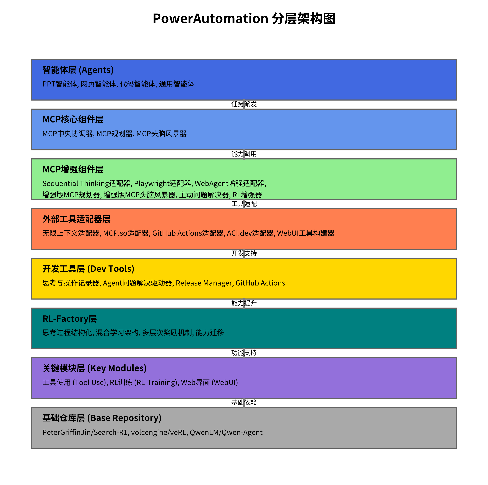

# PowerAutomation 集成方案

本仓库包含PowerAutomation的增强模块，集成了Sequential Thinking MCP、Playwright MCP（含WebAgentB增强）和RL增强器，显著提升了系统的任务规划、创意生成、问题解决和思考能力迁移能力。

## 1. 项目概述

PowerAutomation是一个多智能体自动化平台，支持PPT智能体、代码智能体、网页智能体和通用智能体。本集成方案通过引入Sequential Thinking MCP、Playwright MCP（含WebAgentB增强）和RL增强器，为系统增加了以下核心能力：

- **任务拆解与规划**：通过Sequential Thinking实现更精细的任务拆解和动态调整
- **网页自动化与信息获取**：通过Playwright实现自动化网页操作和信息收集
- **语义理解与交互**：通过WebAgentB实现高级网页理解与交互能力
- **主动问题解决**：实现主动发现问题并推送解决方案到GitHub的功能
- **思考能力迁移**：通过RL增强器实现Manus思考和方案设计能力迁移到MCP组件
- **无限上下文支持**：处理大规模上下文数据，提升长文本理解能力

## 2. 智能体类型

PowerAutomation平台支持多种专业智能体，每种智能体都有其特定的功能和应用场景：

### 2.1 PPT智能体

PPT智能体专注于创建高质量的演示文稿，具备以下能力：

- **文本转PPT**：将文本内容自动转换为结构化的PPT演示文稿
- **思维导图转PPT**：将思维导图数据转换为逻辑清晰的PPT
- **模板应用**：支持多种专业模板，一键应用
- **自动排版和设计**：智能调整布局、字体和颜色方案
- **内容优化**：通过MCP头脑风暴器优化演示内容

### 2.2 网页智能体

网页智能体提供强大的网页交互和数据处理能力：

- **网页内容抓取**：高效抓取网页内容，支持复杂页面结构
- **数据提取与结构化**：将非结构化网页数据转换为结构化格式
- **网页自动化操作**：模拟用户操作，执行复杂的网页任务
- **内容分析与摘要**：智能分析网页内容，生成摘要和关键点
- **多页面导航与数据聚合**：跨页面收集和整合信息

### 2.3 代码智能体

代码智能体专注于代码生成、分析和优化：

- **代码生成**：根据需求描述生成符合规范的代码
- **代码分析**：识别代码问题和优化机会
- **重构建议**：提供代码重构和改进建议
- **文档生成**：自动生成代码文档和注释
- **测试用例生成**：为代码自动创建测试用例

### 2.4 通用智能体

通用智能体作为平台的核心协调者，具备以下能力：

- **任务分发**：将复杂任务分解并分发给专业智能体
- **结果整合**：整合各智能体的处理结果
- **上下文管理**：维护任务上下文，确保连贯性
- **多轮对话**：支持与用户进行多轮交互
- **资源调度**：优化系统资源分配

## 3. MCP增强模块

本集成方案引入了七大MCP（多智能体通信协议）增强模块，显著提升了系统的能力：

### 3.1 Sequential Thinking适配器

Sequential Thinking适配器提供任务拆解和反思能力：

- **任务分解**：将复杂任务分解为可管理的子任务
- **依赖关系管理**：识别和管理子任务间的依赖关系
- **反思与优化**：对执行计划进行反思和优化
- **todo.md生成**：创建结构化的任务清单
- **状态追踪**：追踪任务完成状态

```python
from agents.ppt_agent.core.mcp.sequential_thinking_adapter import SequentialThinkingAdapter

# 初始化Sequential Thinking适配器
adapter = SequentialThinkingAdapter()

# 分解任务
task_result = adapter.decompose_task("设计一个智能家居系统")
```

### 3.2 Playwright适配器

Playwright适配器提供浏览器自动化能力：

- **信息搜索**：自动搜索和获取网络信息
- **页面内容提取**：提取网页内容和结构
- **创意验证**：验证创意的可行性
- **交互式探索**：交互式探索网页内容
- **截图功能**：捕获网页或元素截图

```python
from agents.ppt_agent.core.mcp.playwright_adapter import PlaywrightAdapter

# 初始化Playwright适配器
adapter = PlaywrightAdapter()

# 访问网页
page_content = adapter.visit_and_extract("https://example.com")
```

### 3.3 WebAgentB增强适配器

WebAgentB增强适配器提供高级网页理解与交互能力：

- **增强搜索**：支持多层次信息收集和深度分析
- **语义化提取**：语义化理解和提取页面内容
- **交互式任务**：执行复杂的交互式网页任务
- **深度分析**：对网页内容进行深度语义分析
- **关联页面探索**：智能探索相关页面内容

```python
from agents.ppt_agent.core.mcp.webagent_adapter import WebAgentBAdapter

# 初始化WebAgentB适配器
adapter = WebAgentBAdapter()

# 语义搜索
search_results = adapter.enhanced_search("人工智能最新进展", depth=2)

# 语义化提取页面内容
semantic_content = adapter.semantic_extract("https://example.com")

# 执行交互式任务
task_result = adapter.interactive_task("https://example.com", "填写表单并提交")
```

### 3.4 增强版MCP规划器

增强版MCP规划器集成Sequential Thinking能力：

- **结构化规划**：生成结构化的任务执行计划
- **阶段性反思**：在规划过程中进行反思和调整
- **依赖管理**：管理任务间的复杂依赖关系
- **计划执行**：执行和监控规划好的任务
- **todo状态更新**：自动更新任务状态

```python
from agents.ppt_agent.core.mcp.enhanced_mcp_planner import EnhancedMCPPlanner

# 初始化增强版MCP规划器
planner = EnhancedMCPPlanner()

# 规划任务
plan = planner.plan("开发一个在线教育平台")

# 执行规划好的任务
execution_result = planner.execute_plan(plan)
```

### 3.5 增强版MCP头脑风暴器

增强版MCP头脑风暴器集成Playwright和WebAgentB自动化能力：

- **信息增强创意**：基于网络信息生成创意
- **创意验证**：验证创意的可行性
- **交互式探索**：交互式探索和优化创意
- **创意可视化**：可视化展示创意内容
- **结构化输出**：生成结构化的创意方案

```python
from agents.ppt_agent.core.mcp.enhanced_mcp_brainstorm import EnhancedMCPBrainstorm

# 初始化增强版MCP头脑风暴器
brainstorm = EnhancedMCPBrainstorm()

# 生成创意
ideas = brainstorm.generate("智能家居创新应用")

# 交互式探索创意
exploration = brainstorm.explore_idea(ideas["structured_ideas"][0])

# 可视化创意
visualization = brainstorm.visualize_idea(ideas["structured_ideas"][0])
```

### 3.6 Agent问题解决驱动器

Agent问题解决驱动器（原ManusProblemSolver）集成自动回滚和问题提交能力：

- **版本回滚管理**：支持每个版本的回滚，在持续出错时回滚至保存点
- **自动回滚**：当测试方案持续出错超过5次时自动回滚到前一个保存点
- **PowerAutomation集成**：使用大模型+自动化工具将问题提交给PowerAutomation平台
- **保存点管理**：创建和管理代码版本保存点
- **错误计数与监控**：监控错误次数并触发自动回滚

```python
from development_tools.agent_problem_solver import AgentProblemSolver

# 初始化Agent问题解决驱动器
solver = AgentProblemSolver("/path/to/repo")

# 创建保存点
save_point = solver.create_save_point("feature_implementation")

# 记录测试错误
error_record = solver.record_test_error()

# 回滚到指定保存点
rollback_result = solver.rollback_to_save_point(save_point["id"])
```

### 3.7 RL增强器

RL增强器通过强化学习实现Manus思考和方案设计能力迁移：

- **思考过程结构化**：将思考过程分解为问题分析、方案设计、实现规划和验证评估等阶段
- **混合学习架构**：结合监督学习、强化学习和对比学习的混合架构
- **无限上下文支持**：处理大规模上下文数据，提升长文本理解能力
- **MCP.so集成**：与现有MCP工具无缝集成，扩展系统能力
- **GitHub Actions集成**：与Release Manager协同，实现自动化CI/CD流程

```python
from enhancers.rl_enhancer.core.learning.hybrid import HybridLearner
from enhancers.rl_enhancer.adapters.infinite_context_adapter import InfiniteContextAdapter
from enhancers.rl_enhancer.adapters.mcp_so_adapter import MCPSoAdapter

# 初始化混合学习器
learner = HybridLearner(model_name="bert-base-uncased")

# 改进思考过程
improved_thought = learner.improve_thought("设计一个在线教育平台")

# 初始化无限上下文适配器
context_adapter = InfiniteContextAdapter()

# 处理大规模上下文
context_id = "task_123"
encoding = context_adapter.process_context(context_id, "大规模上下文数据...")

# 初始化MCP.so适配器
mcp_adapter = MCPSoAdapter("/path/to/mcp.so")

# 调用MCP工具
tool_result = mcp_adapter.call_tool("planning_tool", {"task": "设计在线教育平台"})
```

## 4. 开发工具模块

PowerAutomation平台包含多种开发工具模块，支持智能体的开发和运行：

### 4.1 思考与操作记录器

记录智能体的思考过程和操作，用于调试和优化：

- **会话管理**：创建和管理智能体会话
- **思考记录**：记录智能体的思考过程
- **操作记录**：记录智能体执行的操作
- **结果追踪**：追踪操作的结果
- **日志导出**：导出详细的会话日志

### 4.2 Agent问题解决驱动器

帮助解决智能体运行中遇到的问题：

- **问题诊断**：诊断智能体运行问题
- **解决方案推荐**：推荐问题解决方案
- **自动修复**：自动修复常见问题
- **性能优化**：优化智能体性能
- **错误报告**：生成详细的错误报告

### 4.3 Release管理器

管理系统的发布和版本：

- **版本控制**：管理系统版本
- **变更记录**：记录版本变更
- **发布管理**：管理发布流程
- **回滚支持**：支持版本回滚
- **发布通知**：自动发送发布通知

### 4.4 测试与问题收集器

收集和管理测试结果和问题：

- **测试执行**：执行自动化测试
- **结果收集**：收集测试结果
- **问题分类**：分类和优先级排序
- **报告生成**：生成测试报告
- **趋势分析**：分析问题趋势

## 5. 架构设计

### 5.1 核心模块

```
powerautomation/
├── agents/                     # 智能体模块
│   ├── ppt_agent/             # PPT智能体
│   │   ├── core/              # 核心功能
│   │   │   └── mcp/           # MCP优化模块（新增）
│   │   │       ├── sequential_thinking_adapter.py  # Sequential Thinking适配器
│   │   │       ├── playwright_adapter.py           # Playwright适配器
│   │   │       ├── webagent_adapter.py             # WebAgentB增强适配器
│   │   │       ├── enhanced_mcp_planner.py         # 增强版MCP规划器
│   │   │       ├── enhanced_mcp_brainstorm.py      # 增强版MCP头脑风暴器
│   │   │       └── proactive_problem_solver.py     # 主动问题解决器
│   ├── code_agent/            # 代码智能体
│   ├── web_agent/             # 网页智能体
│   └── general_agent/         # 通用智能体
├── enhancers/                  # 增强器模块（新增）
│   └── rl_enhancer/           # RL增强器
│       ├── core/              # 核心功能
│       │   ├── thought/       # 思考过程结构化
│       │   └── learning/      # 学习算法
│       ├── adapters/          # 适配器
│       │   ├── infinite_context_adapter.py  # 无限上下文适配器
│       │   ├── mcp_so_adapter.py           # MCP.so适配器
│       │   └── github_actions_adapter.py   # GitHub Actions适配器
│       └── tests/             # 测试
├── development_tools/          # 开发工具模块
│   ├── agent_problem_solver.py # Agent问题解决驱动器
│   ├── thought_action_recorder.py # 思考与操作记录器
│   └── release_manager.py     # Release管理器
├── tests/                      # 测试目录
│   └── e2e/                   # 端到端测试
└── docs/                       # 文档
```

### 5.2 系统架构图

#### 5.2.1 完整系统架构图



### 5.3 架构说明

PowerAutomation MCP系统采用分层架构设计，主要包含以下核心层级：

- **智能体层 (Agents)**：包括PPT智能体、代码智能体、网页智能体和通用智能体，负责与用户直接交互并执行具体任务。

- **MCP核心组件层**：系统的核心协调层，包括：
  - **MCP中央协调器(MCPCentralCoordinator)**：系统核心，负责协调各模块间的通信和任务分发
  - **MCP规划器(MCPPlanner)**：负责任务分解和执行计划生成
  - **MCP头脑风暴器(MCPBrainstorm)**：负责创意生成和方案优化

- **MCP增强组件层**：提供核心功能增强，包括：
  - **思考与操作记录器(ThoughtActionRecorder)**：记录系统思考过程和操作
  - **Release管理器(ReleaseManager)**：管理系统版本和发布
  - **测试与问题收集器(TestAndIssueCollector)**：收集和管理测试结果和问题
  - **Agent问题解决驱动器(AgentProblemSolver)**：主动发现和解决问题

- **外部工具适配器层**：连接外部工具和服务，包括：
  - **无限上下文适配器**：处理大规模上下文数据
  - **MCP.so适配器**：与现有MCP工具集成
  - **GitHub Actions适配器**：实现CI/CD自动化
  - **ACI.dev适配器**：连接ACI.dev服务
  - **WebUI工具构建器**：构建WebUI工具

- **开发工具层 (Dev Tools)**：提供开发支持工具

- **RL-Factory层**：提供强化学习能力，包括：
  - **Sequential Thinking适配器**：提供任务拆解和反思能力
  - **Playwright适配器**：提供浏览器自动化能力
  - **WebAgentB增强适配器**：提供高级网页理解与交互能力

- **关键模块层 (Key Modules)**：提供核心功能模块，包括：
  - **增强版MCP规划器**：集成Sequential Thinking能力
  - **增强版MCP头脑风暴器**：集成Playwright和WebAgentB自动化能力
  - **主动问题解决器**：提供主动问题解决能力

- **基础仓库层 (Base Repository)**：提供基础代码和资源

#### 5.3.1 GitHub Actions与Release Manager的关系

GitHub Actions与Release Manager紧密集成，形成自动化发布和测试流程：

1. **自动化触发**：Release Manager在发布新版本、合并变更或推送关键内容时，会自动触发GitHub Actions工作流
2. **持续集成**：GitHub Actions执行自动化测试、构建和部署流程，确保代码质量
3. **发布验证**：Release Manager通过GitHub Actions验证发布内容，确保符合规则
4. **回滚机制**：当GitHub Actions检测到问题时，Release Manager可以自动触发回滚操作
5. **通知系统**：GitHub Actions执行结果会反馈给Release Manager，用于决策和通知

这种集成确保了每次发布都经过自动验证，显著提升了系统可靠性与交付效率。

#### 5.3.2 mcp.so与MCP Planner的集成关系

mcp.so作为C/C++实现的高性能底层模块，与MCP Planner的集成方式如下：

1. **工具调用**：MCP Planner通过Python的ctypes或CFFI调用mcp.so提供的工具接口
2. **性能加速**：mcp.so提供高性能算法实现，加速MCP Planner的核心计算
3. **能力扩展**：mcp.so提供系统底层能力，如内存管理、并发控制等
4. **数据交换**：通过共享内存或序列化方式进行高效数据交换
5. **版本兼容**：确保mcp.so与MCP Planner版本兼容，支持平滑升级

这种集成架构结合了Python的灵活性和C/C++的高性能，为系统提供了强大的计算能力和扩展性。

#### 5.3.3 RL增强器与MCP组件的集成关系

RL增强器通过以下方式与MCP组件集成：

1. **思考能力迁移**：RL增强器通过混合学习架构，将Manus的思考和方案设计能力迁移到MCP组件
2. **无限上下文支持**：无限上下文适配器为MCP组件提供处理大规模上下文数据的能力
3. **MCP.so集成**：MCP.so适配器实现与现有MCP工具的无缝集成，扩展系统能力
4. **GitHub Actions集成**：GitHub Actions适配器与Release Manager协同，实现自动化CI/CD流程
5. **端到端测试**：全面的端到端测试确保RL增强器与MCP组件的集成质量

系统数据流向：
1. 智能体（如PPT智能体、网页智能体、代码智能体）发起任务派发至中央协调器
2. 中央协调器根据任务类型分发至规划器或头脑风暴器
3. 规划器和头脑风暴器相互协作，增强彼此能力
4. 规划器通过工具调用方式使用mcp.so提供的工具
5. RL增强器通过思考能力迁移提升MCP组件的规划和创意能力
6. 无限上下文适配器处理大规模上下文数据，支持长文本理解
7. GitHub Actions与Release Manager协同工作，实现自动化CI/CD流程
8. 记录器全程记录思考和操作过程
9. 测试收集器收集问题并反馈给Agent问题解决驱动器
10. Agent问题解决驱动器生成解决方案并推送至GitHub

这一架构设计确保了系统的高度模块化、可扩展性和鲁棒性，同时通过七大MCP增强模块显著提升了系统的任务规划、创意生成、问题解决和思考能力迁移能力。

## 6. 安装与配置

### 6.1 依赖安装

```bash
# 安装基础依赖
pip install -r requirements.txt

# 安装Playwright浏览器
playwright install chrome

# 安装RL增强器依赖
pip install -r enhancers/rl_enhancer/requirements.txt
```

### 6.2 环境配置

```bash
# 设置环境变量
export PYTHONPATH=$PYTHONPATH:/path/to/powerautomation
```

## 7. 使用示例

### 7.1 使用Sequential Thinking适配器

```python
from agents.ppt_agent.core.mcp.sequential_thinking_adapter import SequentialThinkingAdapter

# 初始化Sequential Thinking适配器
adapter = SequentialThinkingAdapter()

# 分解任务
task_result = adapter.decompose_task("设计一个智能家居系统")

print(f"分解结果: {task_result}")
```

### 7.2 使用Playwright适配器

```python
from agents.ppt_agent.core.mcp.playwright_adapter import PlaywrightAdapter

# 初始化Playwright适配器
adapter = PlaywrightAdapter()

# 访问网页
page_content = adapter.visit_and_extract("https://example.com")

print(f"页面内容: {page_content}")
```

### 7.3 使用WebAgentB适配器

```python
from agents.ppt_agent.core.mcp.webagent_adapter import WebAgentBAdapter

# 初始化WebAgentB适配器
adapter = WebAgentBAdapter()

# 语义搜索
search_results = adapter.enhanced_search("人工智能最新进展", depth=2)

# 语义化提取页面内容
semantic_content = adapter.semantic_extract("https://example.com")

# 执行交互式任务
task_result = adapter.interactive_task("https://example.com", "填写表单并提交")

print(f"搜索结果: {search_results}")
print(f"语义内容: {semantic_content}")
print(f"任务结果: {task_result}")
```

### 7.4 使用增强版MCP规划器

```python
from agents.ppt_agent.core.mcp.enhanced_mcp_planner import EnhancedMCPPlanner

# 初始化增强版MCP规划器
planner = EnhancedMCPPlanner()

# 规划任务
plan = planner.plan("开发一个在线教育平台")

# 执行规划好的任务
execution_result = planner.execute_plan(plan)

print(f"规划结果: {plan}")
print(f"执行结果: {execution_result}")
```

### 7.5 使用增强版MCP头脑风暴器

```python
from agents.ppt_agent.core.mcp.enhanced_mcp_brainstorm import EnhancedMCPBrainstorm

# 初始化增强版MCP头脑风暴器
brainstorm = EnhancedMCPBrainstorm()

# 生成创意
ideas = brainstorm.generate("智能家居创新应用")

# 交互式探索创意
exploration = brainstorm.explore_idea(ideas["structured_ideas"][0])

# 可视化创意
visualization = brainstorm.visualize_idea(ideas["structured_ideas"][0])

print(f"创意: {ideas}")
print(f"探索结果: {exploration}")
print(f"可视化结果: {visualization}")
```

### 7.6 使用Agent问题解决驱动器

```python
from development_tools.agent_problem_solver import AgentProblemSolver

# 初始化Agent问题解决驱动器
solver = AgentProblemSolver("/path/to/repo")

# 创建保存点
save_point = solver.create_save_point("feature_implementation")

# 记录测试错误
error_record = solver.record_test_error()

# 回滚到指定保存点
rollback_result = solver.rollback_to_save_point(save_point["id"])

print(f"保存点: {save_point}")
print(f"错误记录: {error_record}")
print(f"回滚结果: {rollback_result}")
```

### 7.7 使用RL增强器

```python
from enhancers.rl_enhancer.core.learning.hybrid import HybridLearner
from enhancers.rl_enhancer.adapters.infinite_context_adapter import InfiniteContextAdapter
from enhancers.rl_enhancer.adapters.mcp_so_adapter import MCPSoAdapter
from enhancers.rl_enhancer.adapters.github_actions_adapter import GitHubActionsAdapter, ReleaseManagerAdapter

# 初始化混合学习器
learner = HybridLearner(model_name="bert-base-uncased")

# 改进思考过程
improved_thought = learner.improve_thought("设计一个在线教育平台")

# 初始化无限上下文适配器
context_adapter = InfiniteContextAdapter()

# 处理大规模上下文
context_id = "task_123"
encoding = context_adapter.process_context(context_id, "大规模上下文数据...")

# 初始化MCP.so适配器
mcp_adapter = MCPSoAdapter("/path/to/mcp.so")

# 调用MCP工具
tool_result = mcp_adapter.call_tool("planning_tool", {"task": "设计在线教育平台"})

# 初始化GitHub Actions适配器
github_adapter = GitHubActionsAdapter("owner", "repo")

# 触发工作流
workflow_result = github_adapter.trigger_workflow("workflow_id", {"ref": "main"})

print(f"改进思考: {improved_thought}")
print(f"上下文编码: {encoding.shape}")
print(f"工具调用结果: {tool_result}")
print(f"工作流触发结果: {workflow_result}")
```

### 7.8 使用PPT智能体

```python
from agents.ppt.ppt_agent import PPTAgent

# 初始化PPT智能体
agent = PPTAgent()

# 文本转PPT
result = agent.process({
    "task_type": "text_to_ppt",
    "title": "人工智能简介",
    "content": "# 人工智能概述\n人工智能是计算机科学的一个分支...\n# 应用领域\n人工智能在多个领域有广泛应用...",
    "template_name": "专业简洁.pptx"
})

print(f"PPT生成结果: {result}")
```

### 7.9 使用网页智能体

```python
from agents.web.web_agent import WebAgent

# 初始化网页智能体
agent = WebAgent()

# 提取网页数据
result = agent.extract_data(
    "https://example.com",
    "提取所有产品信息，包括名称、价格和描述"
)

print(f"数据提取结果: {result}")
```

## 8. 测试

### 8.1 运行测试

```bash
# 运行所有测试
pytest tests/e2e/

# 运行特定模块测试
pytest tests/e2e/test_sequential_thinking.py
pytest tests/e2e/test_playwright_adapter.py

# 运行RL增强器测试
pytest enhancers/rl_enhancer/tests/end_to_end/test_rl_enhancer_integration.py
```

### 8.2 视觉验证测试

```bash
# 运行视觉验证测试
pytest tests/visual_test/test_visual_verification.py
```

## 9. 持续集成

本项目使用GitHub Actions进行持续集成，每次提交都会自动运行测试并生成报告。GitHub Actions与Release Manager紧密集成，形成完整的CI/CD流程。

## 10. 贡献指南

1. Fork本仓库
2. 创建功能分支 (`git checkout -b feature/amazing-feature`)
3. 提交更改 (`git commit -m 'Add some amazing feature'`)
4. 推送到分支 (`git push origin feature/amazing-feature`)
5. 创建Pull Request

## 11. 许可证

本项目采用MIT许可证 - 详见[LICENSE](LICENSE)文件

## 12. 联系方式

- 项目维护者：[维护者姓名](mailto:example@example.com)
- 项目仓库：[GitHub](https://github.com/alexchuang650730/powerautomation)
