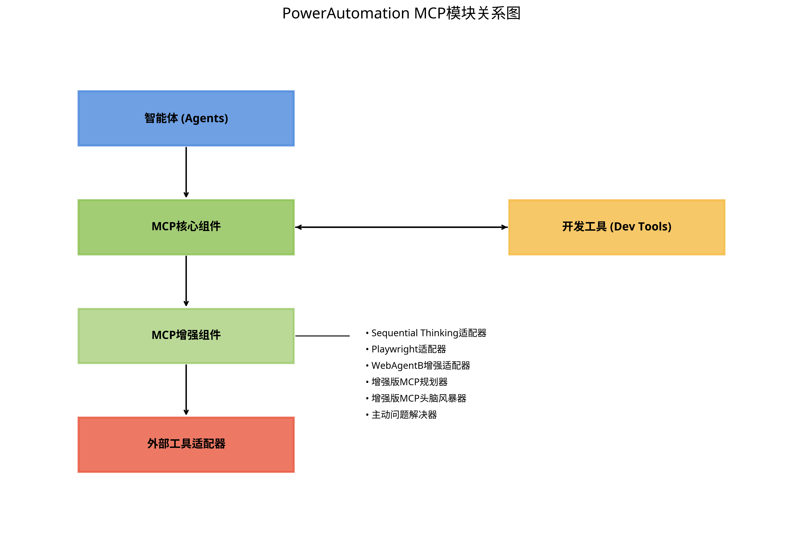

# PowerAutomation 集成方案

本仓库包含PowerAutomation的增强模块，集成了Sequential Thinking MCP和Playwright MCP（含WebAgentB增强），显著提升了系统的任务规划、创意生成和问题解决能力。

## 1. 项目概述

PowerAutomation是一个多智能体自动化平台，支持PPT智能体、代码智能体、网页智能体和通用智能体。本集成方案通过引入Sequential Thinking MCP和Playwright MCP（含WebAgentB增强），为系统增加了以下核心能力：

- **任务拆解与规划**：通过Sequential Thinking实现更精细的任务拆解和动态调整
- **网页自动化与信息获取**：通过Playwright实现自动化网页操作和信息收集
- **语义理解与交互**：通过WebAgentB实现高级网页理解与交互能力
- **主动问题解决**：实现主动发现问题并推送解决方案到GitHub的功能

## 2. 架构设计

### 2.1 核心模块

```
powerautomation/
├── agents/                     # 智能体模块
│   ├── ppt_agent/             # PPT智能体
│   │   ├── core/              # 核心功能
│   │   │   └── mcp/           # MCP优化模块（新增）
│   │   │       ├── sequential_thinking_adapter.py  # Sequential Thinking适配器
│   │   │       ├── playwright_adapter.py           # Playwright适配器
│   │   │       ├── webagent_adapter.py             # WebAgentB增强适配器
│   │   │       ├── enhanced_mcp_planner.py         # 增强版MCP规划器
│   │   │       ├── enhanced_mcp_brainstorm.py      # 增强版MCP头脑风暴器
│   │   │       └── proactive_problem_solver.py     # 主动问题解决器
│   ├── code_agent/            # 代码智能体
│   ├── web_agent/             # 网页智能体
│   └── general_agent/         # 通用智能体
├── development_tools/          # 开发工具模块
├── tests/                      # 测试目录
│   └── e2e/                   # 端到端测试
└── docs/                       # 文档
```

### 2.2 模块关系



- **Sequential Thinking适配器**：提供任务拆解和反思能力
- **Playwright适配器**：提供浏览器自动化能力
- **WebAgentB适配器**：提供高级网页理解与交互能力
- **增强版MCP规划器**：集成Sequential Thinking的规划器
- **增强版MCP头脑风暴器**：集成Playwright和WebAgentB的头脑风暴器
- **主动问题解决器**：集成Sequential Thinking和WebAgentB的问题解决器

## 3. 安装与配置

### 3.1 依赖安装

```bash
# 安装基础依赖
pip install -r requirements.txt

# 安装Playwright浏览器
playwright install chrome
```

### 3.2 环境配置

```bash
# 设置环境变量
export PYTHONPATH=$PYTHONPATH:/path/to/powerautomation
```

## 4. 使用示例

### 4.1 使用Sequential Thinking适配器

```python
from agents.ppt_agent.core.mcp.sequential_thinking_adapter import SequentialThinkingAdapter

# 初始化Sequential Thinking适配器
adapter = SequentialThinkingAdapter()

# 分解任务
task_result = adapter.decompose_task("设计一个智能家居系统")

print(f"分解结果: {task_result}")
```

### 4.2 使用Playwright适配器

```python
from agents.ppt_agent.core.mcp.playwright_adapter import PlaywrightAdapter

# 初始化Playwright适配器
adapter = PlaywrightAdapter()

# 访问网页
page_content = adapter.visit_and_extract("https://example.com")

print(f"页面内容: {page_content}")
```

### 4.3 使用WebAgentB适配器

```python
from agents.ppt_agent.core.mcp.webagent_adapter import WebAgentBAdapter

# 初始化WebAgentB适配器
adapter = WebAgentBAdapter()

# 语义搜索
search_results = adapter.enhanced_search("人工智能最新进展")

print(f"搜索结果: {search_results}")
```

### 4.4 使用增强版MCP规划器

```python
from agents.ppt_agent.core.mcp.enhanced_mcp_planner import EnhancedMCPPlanner

# 初始化增强版MCP规划器
planner = EnhancedMCPPlanner()

# 规划任务
plan = planner.plan("开发一个在线教育平台")

print(f"规划结果: {plan}")
```

### 4.5 使用增强版MCP头脑风暴器

```python
from agents.ppt_agent.core.mcp.enhanced_mcp_brainstorm import EnhancedMCPBrainstorm

# 初始化增强版MCP头脑风暴器
brainstorm = EnhancedMCPBrainstorm()

# 生成创意
ideas = brainstorm.generate("智能家居创新应用")

print(f"创意: {ideas}")
```

### 4.6 使用主动问题解决器

```python
from agents.ppt_agent.core.mcp.proactive_problem_solver import ProactiveProblemSolver

# 初始化主动问题解决器
solver = ProactiveProblemSolver("/path/to/repo")

# 手动触发检查
result = solver.solve_on_event("manual_check")

print(f"检查结果: {result}")
```

## 5. 测试

### 5.1 运行测试

```bash
# 运行所有测试
pytest tests/e2e/

# 运行特定模块测试
pytest tests/e2e/test_sequential_thinking.py
pytest tests/e2e/test_playwright_adapter.py
```

### 5.2 视觉验证测试

```bash
# 运行视觉验证测试
pytest tests/e2e/test_visual_verification.py
```

## 6. 持续集成

本项目使用GitHub Actions进行持续集成，每次提交都会自动运行测试并生成报告。

## 7. 贡献指南

1. Fork本仓库
2. 创建功能分支 (`git checkout -b feature/amazing-feature`)
3. 提交更改 (`git commit -m 'Add some amazing feature'`)
4. 推送到分支 (`git push origin feature/amazing-feature`)
5. 创建Pull Request

## 8. 许可证

本项目采用MIT许可证 - 详见[LICENSE](LICENSE)文件

## 9. 联系方式

- 项目维护者：[维护者姓名](mailto:example@example.com)
- 项目仓库：[GitHub](https://github.com/alexchuang650730/powerautomation)
